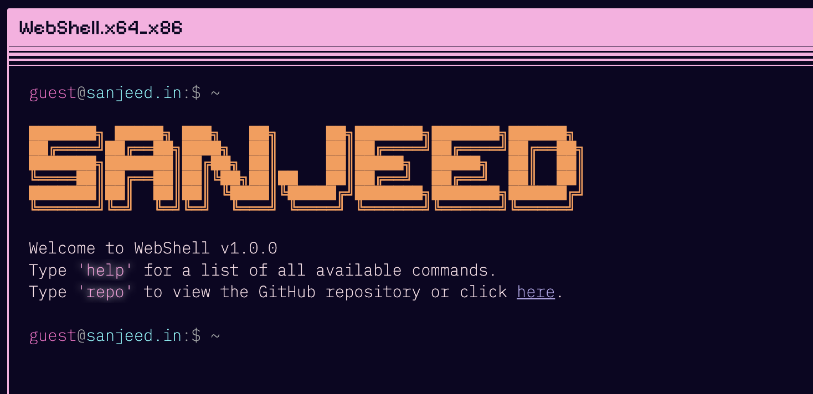

# [WebShell | Terminal Portfolio Website](https://terminal.sanjeed.in/)




## Features
* **[Tab]** for auto completion.
* **[Esc]** to clear the input line.
* **[↑][↓]** to scroll through your command history.

## ???
<div align="center">
  
</div>
How did we get here?

## Configuration

Most of the configuration is done in the `config.json` file.

> Generate ascii [here](https://patorjk.com/software/taag/). ANSI Shadow is the current font family.

```json
{
  "ascii": [
  "███████╗ █████╗ ███╗   ██╗     ██╗███████╗███████╗██████╗ ",
  "██╔════╝██╔══██╗████╗  ██║     ██║██╔════╝██╔════╝██╔══██╗",
  "███████╗███████║██╔██╗ ██║     ██║█████╗  █████╗  ██║  ██║",
  "╚════██║██╔══██║██║╚██╗██║██   ██║██╔══╝  ██╔══╝  ██║  ██║",
  "███████║██║  ██║██║ ╚████║╚█████╔╝███████╗███████╗██████╔╝",
  "╚══════╝╚═╝  ╚═╝╚═╝  ╚═══╝ ╚════╝ ╚══════╝╚══════╝╚═════╝"
],

  "repoLink": "https://github.com/sanjeed5/terminal-portfolio",
  "social": {
    "email": "hi@sanjeed.in",
    "github": "sanjeed5",
    "linkedin": "mohammed-sanjeed",
    "twitter": "sanjeed_i",
    "instagram": "sanjeed.i"
  },
  "aboutGreeting": "Hi I'm Sanjeed. I'm a PM who codes. I love building. Tinkering with LLMs nowadays.",
  "projects": [
    [
      "Lilly - Whatsapp AI Chatbot",
      "Beware: Lilly can be too sarcastic sometimes",
      "https://www.sanjeed.in/whatsapp-ai-chatbot"
    ],
    [
      "Terminal on my website",
      "Yes, this one lol",
      "https://github.com/sanjeed5/terminal-portfolio"
    ],
    [
      "All",
      "View all of the projects I'm working on.",
      "https://www.sanjeed.in/"
    ]
  ]
}
```

## Run the Project Locally:

Clone the repository
```shell
git clone https://github.com/nasan016/webshell.git
```
Go to the project directory
```shell
cd webshell
```
Install the dependencies
```shell
npm install
```
Start the server
```shell
npm run dev
```
